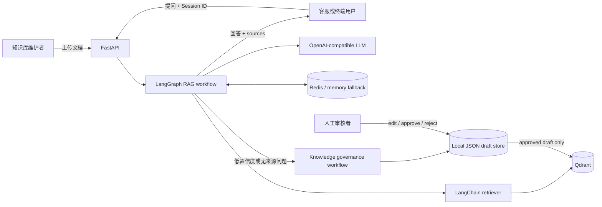

# Self-hosted RAG Customer Service Agent

[](https://github.com/Estrella-Qii/ai-customer-service-agent/actions/workflows/ci.yml)
[](LICENSE)
[](https://www.python.org/)

一个可自托管的企业 RAG 智能客服 Agent。它让团队上传自己的 `.txt`、`.md` 或 `.pdf` 知识文档，使用 Qdrant 检索相关片段，通过任意 OpenAI-compatible LLM 生成有来源依据的客服回答，并用 Redis 保存多轮会话。

项目还包含一个实验性的知识库治理闭环：从未回答问题中识别知识缺口、生成待审草稿，经人工批准后再写回向量库。它适合本地验证、二次开发和小规模内部试用；当前不是未经加固即可直接暴露到公网的生产客服系统。

## 项目解决什么问题

企业客服机器人经常卡在三个地方：知识分散、回答缺乏依据、知识库更新滞后。本项目把这些环节连接起来：

- 文档上传后自动解析、切片、向量化并存入 Qdrant。
- 回答前先检索企业知识库，返回引用文件、片段编号和相似度分数。
- 用 Session ID 保留多轮上下文；Redis 不可用时可降级到进程内存。
- 记录缺少可靠来源的问题，帮助维护者发现知识覆盖缺口。
- 生成的知识草稿必须经过人工 `approve / edit / reject`，不会自动污染知识库。

## 核心特性

- FastAPI API、Swagger 文档和开箱即用的 Web 工作台
- LangGraph 编排的 RAG 问答与知识治理工作流
- OpenAI-compatible LLM 与 Embedding 接口
- Qdrant 文档入库、列表、替换、删除和相似度检索
- Redis 多轮会话，带受控的内存降级
- 文档上传类型、文件名、大小和请求长度校验
- 依赖就绪检查、结构化来源信息和对外错误脱敏
- Docker Compose 本地部署、自动化测试、Lint、依赖审计和镜像构建 CI

## 架构



主链路：

```text
问题 -> 加载会话 -> Qdrant 检索 -> LLM 基于上下文回答 -> 保存会话 -> 返回来源
```

治理链路：

```text
未覆盖问题 -> 覆盖判断 -> 缺口聚类 -> 草稿生成 -> 人工审核 -> Qdrant 回流
```

更详细的节点和数据流见 [治理架构说明](docs/governance_agent_architecture.md)。

## 快速启动

### 方式一：Docker Compose

要求：Docker Compose v2，以及可用的 OpenAI-compatible Chat / Embedding 服务。

```bash
git clone https://github.com/Estrella-Qii/ai-customer-service-agent.git
cd ai-customer-service-agent
cp .env.example .env
```

编辑 `.env`，至少填入：

```dotenv
LLM_API_KEY=replace_me
LLM_BASE_URL=https://your-provider.example/v1
LLM_MODEL=your-chat-model
SILICONFLOW_API_KEY=replace_me
SILICONFLOW_BASE_URL=https://your-provider.example/v1
EMBEDDING_MODEL=your-embedding-model
```

然后启动：

```bash
docker compose up --build
```

打开：

- Web 工作台：<http://127.0.0.1:8000>
- Swagger API：<http://127.0.0.1:8000/docs>
- 就绪检查：<http://127.0.0.1:8000/health/ready>

### 方式二：本机运行 API，Docker 只运行依赖

```bash
python -m venv .venv
```

Windows PowerShell：

```powershell
.\.venv\Scripts\Activate.ps1
Copy-Item .env.example .env
pip install -r requirements.txt
docker compose up -d qdrant redis
python -m uvicorn app.main:app --reload
```

macOS / Linux：

```bash
source .venv/bin/activate
cp .env.example .env
pip install -r requirements.txt
docker compose up -d qdrant redis
python -m uvicorn app.main:app --reload
```

本机 API 连接 Docker 中的 Qdrant 时，使用 `QDRANT_URL=http://127.0.0.1:6333`；只有 API 也在 Compose 网络中时才使用 `http://qdrant:6333`。

## 第一次使用

1. 确认 Web 页右上角显示 LLM、Embedding 和 Qdrant 已就绪。
2. 从 `knowledge_base_samples/` 选择一个示例文档上传。
3. 点击示例问题，或输入“退款多久到账？”。
4. 检查回答下方是否显示来源文件、Chunk 编号与 Score。
5. 使用相同 Session ID 追问，验证多轮上下文；再用“加载历史”查看服务端保存的消息。

Web 页不会把示例数据伪装成真实企业数据。仓库内示例政策和问题均为 mock 内容。

## API 示例

### 上传知识文档

```bash
curl -X POST http://127.0.0.1:8000/documents/upload \
  -F "file=@knowledge_base_samples/refund_policy.md"
```

### RAG 问答

```bash
curl -X POST http://127.0.0.1:8000/rag/ask \
  -H "Content-Type: application/json" \
  -d '{
    "question": "退款多久到账？",
    "top_k": 4,
    "session_id": "example-session"
  }'
```

响应包含 `answer`、`session_id`、`memory_backend` 和真实检索得到的 `sources`；若向量库没有对应文档，项目不会伪造引用。

### 查看与清空会话

```bash
curl http://127.0.0.1:8000/sessions/example-session/history
curl -X DELETE http://127.0.0.1:8000/sessions/example-session
```

### 分析知识缺口

```bash
curl -X POST http://127.0.0.1:8000/governance/analyze \
  -H "Content-Type: application/json" \
  -d '{
    "questions": ["优惠券过期后还能补发吗？", "发票抬头可以修改吗？"],
    "top_k": 4
  }'
```

完整闭环可运行 `python scripts/demo_governance_flow.py`，说明见 [Demo 指南](docs/demo_script.md)。

## 配置

| 变量 | 必需 | 默认值 | 说明 |
| --- | --- | --- | --- |
| `LLM_API_KEY` | 是 | 空 | Chat 模型密钥 |
| `LLM_BASE_URL` | 是 | 空 | OpenAI-compatible `/v1` 地址 |
| `LLM_MODEL` | 是 | `deepseek-ai/DeepSeek-V4-Flash` | Chat 模型名 |
| `SILICONFLOW_API_KEY` | 是 | 空 | Embedding 密钥；名称保留用于兼容现有配置 |
| `SILICONFLOW_BASE_URL` | 是 | `https://api.siliconflow.cn/v1` | OpenAI-compatible Embedding 地址 |
| `EMBEDDING_MODEL` | 是 | `Qwen/Qwen3-Embedding-4B` | Embedding 模型名 |
| `EMBEDDING_DIMENSION` | 否 | `0` | `0` 表示首次调用时自动探测 |
| `QDRANT_URL` | 否 | `http://127.0.0.1:6333` | Qdrant HTTP 地址 |
| `QDRANT_COLLECTION` | 否 | `customer_service_docs` | Collection 名称 |
| `REDIS_URL` | 否 | `redis://localhost:6379/0` | 会话存储地址 |
| `MAX_UPLOAD_BYTES` | 否 | `10485760` | 单个上传文件大小上限 |
| `MAX_QUESTION_CHARS` | 否 | `4000` | 单次问题字符上限 |

切换 Embedding 模型后，如果向量维度不同，应重新创建 demo collection：

```bash
python scripts/reset_demo_store.py
```

这会删除当前配置的 Qdrant collection。请勿对未备份的生产数据运行该脚本。

## 自部署说明

- API 容器以非 root 用户运行，Qdrant 数据写入 `./qdrant_storage`，Redis 使用命名卷持久化。
- Compose 仅把 API 和 Qdrant 调试端口暴露给宿主机；Redis 留在内部网络。
- `/health` 是进程存活检查；`/health/ready` 会检查配置和 Qdrant，并报告 Redis 或内存后端。
- 本地 JSON 治理存储适用于单实例 MVP。多副本部署前必须迁移到事务数据库。
- 当前没有身份认证、租户隔离和速率限制。不要把实例直接暴露到公网；建议在反向代理或零信任网关后添加 TLS、认证和限流。

## 测试与质量检查

```bash
pip install -r requirements-dev.txt
ruff check .
ruff format --check .
python -m unittest discover -s tests -v
pip-audit -r requirements.txt
docker compose config --quiet
docker build -t ai-customer-service-agent:local .
```

CI 对 Pull Request 执行相同的 Python 检查、依赖漏洞审计、Compose 校验和镜像构建。

## 项目边界

当前版本没有声称拥有真实企业用户、下载量、线上 SLA 或离线效果指标。尚未解决的生产化问题包括鉴权与多租户、限流、持久化审核数据库、评测集、可观测性和数据保留策略；详见 [Roadmap](ROADMAP.md)。

## 参与贡献

欢迎提交可复现的 Bug、文档改进和范围清晰的功能 PR。开始前请阅读 [CONTRIBUTING.md](CONTRIBUTING.md) 与 [SECURITY.md](SECURITY.md)。行为规范见 [CODE_OF_CONDUCT.md](CODE_OF_CONDUCT.md)。

## 版本与发布

- 变更记录：[CHANGELOG.md](CHANGELOG.md)
- `v0.1.0` 发布说明草案：[docs/releases/v0.1.0.md](docs/releases/v0.1.0.md)

在测试、容器验证和维护者审核完成前，发布说明保持草案状态，不代表已经发布稳定版本。

## License

[MIT](LICENSE)
